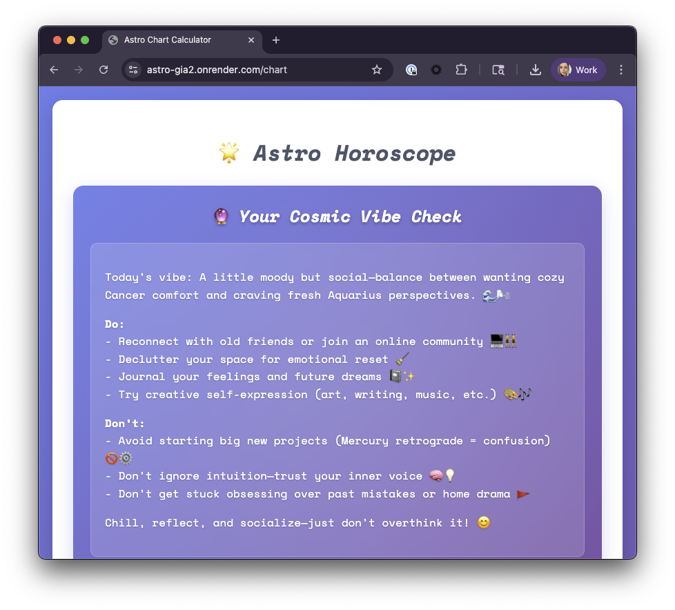

# Astro Horoscope

<div align="center">
  
</div>

## Your cosmic vibe check

A web-based astrological horoscope for only the chillest of humans

## Features

- 🌟 Calculate natal charts with Sun, Moon, and Ascendant signs
- 📡 Check current Mercury retrograde status
- 🌐 Web interface for easy input and viewing
- 📱 Responsive design
- 🔮 Gives you an amazing horoscope

## Installation

1. Install dependencies:
```bash
pip install -r requirements.txt
```

2. Run the Flask app:
```bash
python run.py
```

3. Open your browser to: http://localhost:8080

## Location Format Examples

- **New York City:** 40n42, 74w00, -05:00 (EST) / -04:00 (EDT)
- **Los Angeles:** 34n03, 118w15, -08:00 (PST) / -07:00 (PDT)
- **London:** 51n30, 0w10, +00:00 (GMT) / +01:00 (BST)
- **Paris:** 48n52, 2e20, +01:00 (CET) / +02:00 (CEST)

## Example horoscope response 

```
Today's vibe: A little moody but social—balance between wanting cozy Cancer comfort and craving fresh Aquarius perspectives. 🌊🌬️

Do:
- Reconnect with old friends or join an online community 💻👯
- Declutter your space for emotional reset 🧹
- Journal your feelings and future dreams 📓✨
- Try creative self-expression (art, writing, music, etc.) 🎨🎶

Don't:
- Avoid starting big new projects (Mercury retrograde = confusion) 🚫⚙️
- Don't ignore intuition—trust your inner voice 🧠💡
- Don't get stuck obsessing over past mistakes or home drama 🚩

Chill, reflect, and socialize—just don't overthink it! 😊
```

## Screenshot

<div align="center">
  
</div>

## Development 

### Run all tests

```bash
make test
```

### Run with coverage

```bash
make test-coverage
```

### Run specific test types

```bash
make test-unit
make test-frontend
```


