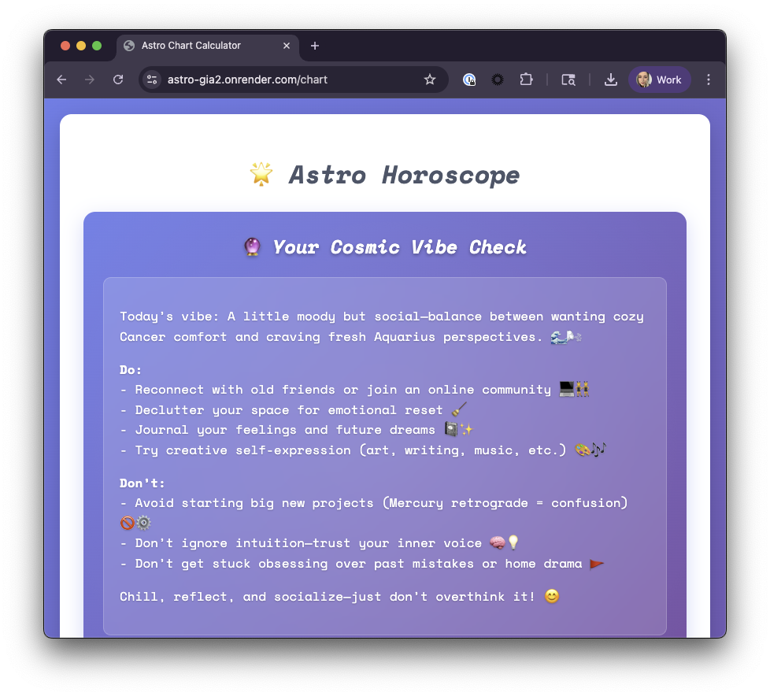

# Astro Horoscope

# 🔮

## Your cosmic vibe check

A web-based astrological horoscope for only the chillest of humans

## Features

- 🌟 Calculate natal charts with Sun, Moon, and Ascendant signs
- 📡 Check current Mercury retrograde status
- 🌐 Web interface for easy input and viewing
- 📱 Responsive design
- 🔮 Gives you an amazing horoscope

## Installation

### Option 1: GitHub Codespaces (Recommended)

1. Click the "Code" button on GitHub
2. Select the "Codespaces" tab
3. Click "Create codespace on main"
4. Set your Anthropic API key:

```bash
export ANTHROPIC_TOKEN="your-api-key-here"
```

5. Run the app:

```bash
python main.py
```

The environment will automatically set up Python 3.10 and install all dependencies. The app will be available on port 5000 with automatic port forwarding.

### Option 2: Local Setup

1. Install dependencies:

```bash
pip install -r requirements.txt
```

2. Set your Anthropic API key. The easiest way for local development is a `.env` file (loaded automatically on startup):

```bash
cp .env.example .env        # macOS/Linux
# Copy-Item .env.example .env  # Windows PowerShell
```

Then open `.env` and set your key (get one at https://console.anthropic.com/):

```
ANTHROPIC_TOKEN=your-api-key-here
```

`.env` is git-ignored, so your key stays out of version control. Alternatively, you can export it in your shell instead of using a file:

```bash
export ANTHROPIC_TOKEN="your-api-key-here"          # macOS/Linux
# $env:ANTHROPIC_TOKEN = "your-api-key-here"        # Windows PowerShell
```

3. Run the Flask app:

```bash
python run.py
```

4. Open your browser to: http://localhost:8080

## Location Format Examples

- **New York City:** 40n42, 74w00, -05:00 (EST) / -04:00 (EDT)
- **Los Angeles:** 34n03, 118w15, -08:00 (PST) / -07:00 (PDT)
- **London:** 51n30, 0w10, +00:00 (GMT) / +01:00 (BST)
- **Paris:** 48n52, 2e20, +01:00 (CET) / +02:00 (CEST)

## Example outputs

### Horoscope

```
Today’s vibe: 🔥🦁 Moody but bold—emotions are deep, but don’t be afraid to shine your true self!

Do:
- Hang with friends or do something creative 🎨
- Reflect on your feelings but don’t get stuck in them 🤔
- Try something new or quirky that makes you stand out 🌈

Don’t:
- Start intense convos with family (could get dramatic) 🥲
- Overshare secrets or dig too deep today 🕵️‍♀️
- Expect work/tasks to go perfectly (Mercury rx chaos) 💻

Song: Midwest Pen Pals – “Movies Like Juno” 🎸
Beverage: Iced matcha latte—refreshing but comforting like Cancer season, with that Leo pop 💚🤩
```

### Full Chart

```
🦀🌙✨ Deep feels and empathy (Sun in Cancer 12H) but secretly—total softie, kinda mysterious, lowkey psychic.
🦁👑🔥 Big Leo rising energy—charisma! Venus in 1H = gorgeous vibes and main character moments, even if you’re shy inside.
🧠🌊 Moon in Aquarius 7H = quirky, unique tastes in friends/love. Needs independence in relationships, loves the oddballs.
💪🏽🏆 Mars/Neptune in Capricorn (6H): hardworking, dreamy realist, but also risk of burnout from helping everyone.
🎢 Uranus/Saturn in 5H = creative rebel but needs structure; probs has some weird hobbies or unconventional romantic adventures.
🦂🏠 Pluto in 4H = deep family stuff, possible emo backstory. Transformation happens at home.
💔🗣️ Chiron in 11H = past friendship hurts, longing for your soul tribe.
🌧️🎸 Overall theme: sensitive outsider with a fierce heart, balancing deep feels & eccentric social vibes.

🛏️ Song Rec: "Never Meant" by American Football fits your vibe perfectly!
```

### Personalized Taco Bell Order

```
OMG yessss let’s Taco-Bell-astro-vibe it out for this Cancer Sun/Moon Aquarius/Cancer Rising moodboard 🌊💡🥰:

✨Big Soup Mama Cancer/Double Water Vibes: Homey & nurturing, living their best comfort food life
🔌Moon in Aqua: Unexpected WEIRD; likes a side of eccentric with their wrapper
💕Venus in Leo in 1st: Main character energy, give ‘em drama and flare
🏍️Mars Cap/Neptune Cap (6th House Elite Productivity): Serious efficiency snacker

Your Cosmic Taco Bell Order:

Quesarito, but Custom: Double everything inside 🌯🌊 (Cancers need that hug-in-a-wrap; you love extra comfort. Plus, it’s hidden and gooey like a true Crab)

Cheesy Fiesta Potatoes: Because tbh, these are unique af, and Moon in Aqua loves unpredictable sides, okay?? 🥔

Doritos Locos Taco Supreme w/ cool ranch 🌈🤪 (Spice up your emotions, and let your uranusian side go wildyyyho!!)

Nachos BellGrande but make it aesthetic 🧀🔥 (Cancer Sun+Venus Leo = MAXIMUM drama cheese, please, AND sharable for your homebody heart)

Baja Blast Freeze: For pure “I am my own party” Uranian Quirked Up Silliness ✨🧊💙

Side of Guac: Because Pluto in 4th = lowkey you want depth with that basic chip. 🥑

Total Vibes: Chaotic cozy inventor energy, high on sauce, extra Drama-Luv.
Skip the tacos if you’re working late, triple up on sides if you’re friendship-brained tonight! 🤍👾

#LuncheonLagoon #MainCharacterMeal 🌊🦀🪐🔥
```

## Screenshot

<div align="center">
  
</div>

## Development

### Run all tests

```bash
make test
```

### Run with coverage

```bash
make test-coverage
```

### Run specific test types

```bash
make test-unit
make test-frontend
```
